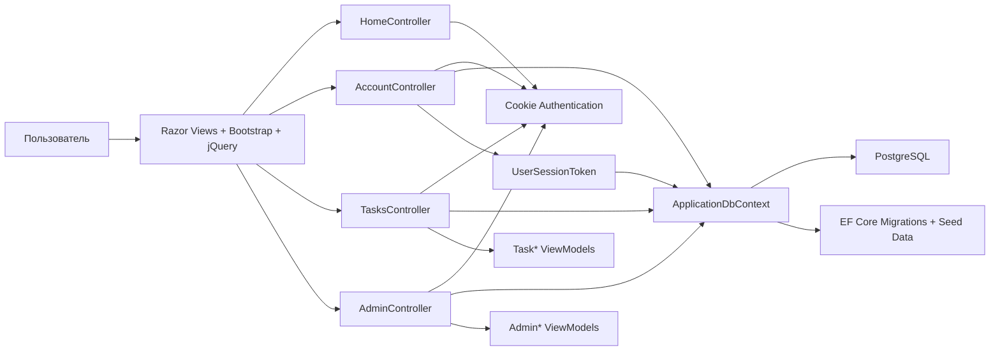

# Crystal — обзор приложения

## Назначение

Crystal Task Manager — веб-приложение для управления задачами сотрудников и проектных очередей.
Основная цель системы:

- хранить задачи и комментарии к ним;
- ограничивать доступ к задачам по проектам;
- управлять жизненным циклом статусов задач;
- позволять администратору настраивать справочники и связи между сущностями.

## Технологический стек

- **ASP.NET Core MVC** — веб-слой и страницы;
- **Entity Framework Core** — доступ к данным и миграции;
- **PostgreSQL** — основная база данных;
- **Cookie Authentication** — аутентификация пользователей;
- **Bootstrap 5 + Font Awesome** — интерфейс;
- **jQuery AJAX** — динамическая подгрузка таблицы задач и комментариев без перезагрузки страницы.

## Основные модули

### 1. Представление

Папки:

- `Views/Shared` — общий layout;
- `Views/Account` — вход в систему;
- `Views/Tasks` — список задач, карточка, формы создания и редактирования;
- `Views/Admin` — административные формы.

В `Views/Shared/_Layout.cshtml` подключаются Bootstrap, Font Awesome и jQuery.

### 2. Контроллеры

#### `HomeController`

- перенаправляет анонимного пользователя на вход;
- авторизованного пользователя — на список задач.

#### `AccountController`

- показывает форму входа;
- проверяет email и пароль;
- создаёт cookie-сессию;
- выполняет выход из системы.

#### `TasksController`

Основной рабочий контроллер:

- список задач с фильтрацией и пагинацией;
- создание и редактирование задач;
- карточка задачи;
- смена статуса только через разрешённые переходы;
- добавление и загрузка комментариев через AJAX.

#### `AdminController`

Только для роли **Admin**. Управляет:

- пользователями;
- проектами;
- очередями;
- статусами задач;
- переходами между статусами;
- определениями кастомных полей.

### 3. Данные и доменная модель

Основные сущности:

- `User` — пользователь системы;
- `ProjectEntity` — проект;
- `UserProjectAccess` — связь пользователя с доступными проектами;
- `WorkQueue` — очередь работ;
- `TaskItem` — задача;
- `TaskComment` — комментарий к задаче;
- `TaskStatusEntity` — статус задачи;
- `TaskStatusTransition` — разрешённый переход между статусами;
- `TaskFieldDefinition` — определение дополнительного поля;
- `TaskFieldValue` — значение дополнительного поля;
- `UserSessionToken` — запись серверной сессии с access/refresh токенами.

### 4. Авторизация и сессии

В приложении используется гибридная схема:

- пользователи по-прежнему аутентифицируются через cookie;
- при логине создаётся запись `UserSessionToken`;
- в этой записи хранятся хэши access и refresh токенов;
- access token используется как текущий маркер авторизации;
- refresh token хранится в HttpOnly cookie и позволяет продлить сессию;
- при истечении access token система автоматически пытается обновить пару токенов;
- при logout сессия помечается отозванной.

### 5. ViewModel-слой

ViewModel используются для:

- форм входа;
- форм создания/редактирования задач;
- карточки задачи;
- административных форм;
- таблицы со списком задач.

Это позволяет не перегружать view прямой работой с EF-сущностями.

### 6. Доступ и безопасность

- вход выполняется через cookie-аутентификацию;
- сессионные токены хранятся в БД в виде хэшей, а не в открытом виде;
- роль `Admin` даёт полный доступ к административному разделу;
- доступ к задачам ограничивается проектами пользователя;
- изменение статуса задачи проверяется по таблице разрешённых переходов;
- добавление комментариев и изменение данных защищены антифоржери-токенами.

## Как модули взаимодействуют друг с другом

## Типовые сценарии

### Вход в систему

1. Пользователь открывает приложение.
2. `HomeController` перенаправляет его на `/Account/Login`, если он не авторизован.
3. `AccountController` ищет пользователя по email.
4. Пароль проверяется через `PasswordHasher`.
5. После успешного входа создаётся cookie-сессия с ролью `Admin` или `User`.

### Работа с задачами

1. `TasksController` строит список задач с фильтрами по:
   - поиску,
   - статусу,
   - приоритету,
   - проекту.
2. Таблица подгружается частично через AJAX-метод `Filter`.
3. Карточка задачи показывает:
   - проект,
   - очередь,
   - исполнителя,
   - автора,
   - дедлайн,
   - приоритет,
   - кастомные поля,
   - комментарии.
4. Из карточки можно:
   - поменять статус только по разрешённому переходу;
   - добавить комментарий без перезагрузки страницы.

### Администрирование

Администратор через `AdminController`:

- создаёт и редактирует пользователей;
- назначает доступ к проектам;
- настраивает очереди;
- добавляет статусы и переходы;
- создаёт определения дополнительных полей.
