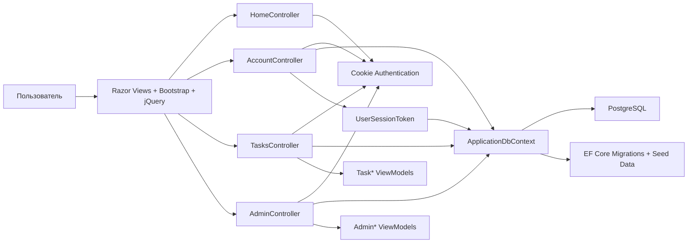

# Crystal — обзор приложения

## Назначение

Crystal Task Manager — веб-приложение для управления задачами сотрудников и проектных очередей.
Основная цель системы:

- хранить задачи и комментарии к ним;
- ограничивать доступ к задачам по проектам;
- управлять жизненным циклом статусов задач;
- позволять администратору настраивать справочники и связи между сущностями.

## Технологический стек

- **ASP.NET Core MVC** — веб-слой и страницы;
- **Entity Framework Core** — доступ к данным и миграции;
- **PostgreSQL** — основная база данных;
- **Cookie Authentication** — аутентификация пользователей;
- **Bootstrap 5 + Font Awesome** — интерфейс;
- **jQuery AJAX** — динамическая подгрузка таблицы задач и комментариев без перезагрузки страницы.

## Основные модули

### 1. Представление

Папки:

- `Views/Shared` — общий layout;
- `Views/Account` — вход в систему;
- `Views/Tasks` — список задач, карточка, формы создания и редактирования;
- `Views/Admin` — административные формы.

В `Views/Shared/_Layout.cshtml` подключаются Bootstrap, Font Awesome и jQuery.

### 2. Контроллеры

#### `HomeController`

- перенаправляет анонимного пользователя на вход;
- авторизованного пользователя — на список задач.

#### `AccountController`

- показывает форму входа;
- проверяет email и пароль;
- создаёт cookie-сессию;
- выполняет выход из системы.

#### `TasksController`

Основной рабочий контроллер:

- список задач с фильтрацией и пагинацией;
- создание и редактирование задач;
- карточка задачи;
- смена статуса только через разрешённые переходы;
- добавление и загрузка комментариев через AJAX.

#### `AdminController`

Только для роли **Admin**. Управляет:

- пользователями;
- проектами;
- очередями;
- статусами задач;
- переходами между статусами;
- определениями кастомных полей.

### 3. Данные и доменная модель

Основные сущности:

- `User` — пользователь системы;
- `ProjectEntity` — проект;
- `UserProjectAccess` — связь пользователя с доступными проектами;
- `WorkQueue` — очередь работ;
- `TaskItem` — задача;
- `TaskComment` — комментарий к задаче;
- `TaskStatusEntity` — статус задачи;
- `TaskStatusTransition` — разрешённый переход между статусами;
- `TaskFieldDefinition` — определение дополнительного поля;
- `TaskFieldValue` — значение дополнительного поля;
- `UserSessionToken` — запись серверной сессии с access/refresh токенами.

### 4. Авторизация и сессии

В приложении используется гибридная схема:

- пользователи по-прежнему аутентифицируются через cookie;
- при логине создаётся запись `UserSessionToken`;
- в этой записи хранятся хэши access и refresh токенов;
- access token используется как текущий маркер авторизации;
- refresh token хранится в HttpOnly cookie и позволяет продлить сессию;
- при истечении access token система автоматически пытается обновить пару токенов;
- при logout сессия помечается отозванной.

### 5. ViewModel-слой

ViewModel используются для:

- форм входа;
- форм создания/редактирования задач;
- карточки задачи;
- административных форм;
- таблицы со списком задач.

Это позволяет не перегружать view прямой работой с EF-сущностями.

### 6. Доступ и безопасность

- вход выполняется через cookie-аутентификацию;
- сессионные токены хранятся в БД в виде хэшей, а не в открытом виде;
- роль `Admin` даёт полный доступ к административному разделу;
- доступ к задачам ограничивается проектами пользователя;
- изменение статуса задачи проверяется по таблице разрешённых переходов;
- добавление комментариев и изменение данных защищены антифоржери-токенами.

## Как модули взаимодействуют друг с другом



## Типовые сценарии

### Вход в систему

1. Пользователь открывает приложение.
2. `HomeController` перенаправляет его на `/Account/Login`, если он не авторизован.
3. `AccountController` ищет пользователя по email.
4. Пароль проверяется через `PasswordHasher`.
5. После успешного входа создаётся cookie-сессия с ролью `Admin` или `User`.

### Работа с задачами

1. `TasksController` строит список задач с фильтрами по:
   - поиску,
   - статусу,
   - приоритету,
   - проекту.
2. Таблица подгружается частично через AJAX-метод `Filter`.
3. Карточка задачи показывает:
   - проект,
   - очередь,
   - исполнителя,
   - автора,
   - дедлайн,
   - приоритет,
   - кастомные поля,
   - комментарии.
4. Из карточки можно:
   - поменять статус только по разрешённому переходу;
   - добавить комментарий без перезагрузки страницы.

### Администрирование

Администратор через `AdminController`:

- создаёт и редактирует пользователей;
- назначает доступ к проектам;
- настраивает очереди;
- добавляет статусы и переходы;
- создаёт определения дополнительных полей.

# Crystal — развертывание

## Что нужно для запуска

- **.NET 8 SDK** для локального запуска и сборки;
- **PostgreSQL 16** или совместимая версия;
- доступ к базе `crystal_task_manager`;
- при запуске в контейнере — сетевой доступ между приложением и PostgreSQL.

## Как работает авторизация после обновления

После добавления access/refresh токенов схема входа стала такой:

1. Пользователь вводит email и пароль.
2. `AccountController` проверяет пароль и создаёт серверную сессию `UserSessionToken`.
3. Генерируются две случайные строки:
   - **access token** — короткоживущий, используется как текущий маркер сессии;
   - **refresh token** — живёт дольше и хранится в HttpOnly cookie.
4. В БД сохраняются только **хэши** токенов.
5. Cookie-аутентификация хранит principal с идентификатором сессии и access token.
6. При каждом запросе `OnValidatePrincipal` проверяет:
   - не отозвана ли сессия;
   - не истёк ли refresh token;
   - совпадает ли access token.
7. Если access token истёк, но refresh token ещё действителен, токены автоматически пересоздаются и обновляются.
8. При logout сессия помечается отозванной, cookie удаляется.

## Конфигурация подключения к БД

В `Crystal.Web/appsettings.json` по умолчанию задана строка подключения:

```json
{
  "ConnectionStrings": {
    "DefaultConnection": "Host=localhost;Port=5432;Database=crystal_task_manager;Username=postgres;Password=postgres"
  }
}
```

Если приложение запускается **на хосте**, а PostgreSQL — в Docker, `localhost` подходит.

Если приложение запускается **тоже в Docker**, нужно заменить `Host=localhost` на имя сервиса, например:

```text
Host=postgres;Port=5432;Database=crystal_task_manager;Username=postgres;Password=postgres
```

## Локальный запуск

1. Поднять PostgreSQL:

```powershell
docker compose up -d postgres
```

2. Запустить приложение:

```powershell
dotnet run --project Crystal.Web/Crystal.Web.csproj
```

3. На старте приложение автоматически применяет миграции:

```csharp
dbContext.Database.Migrate();
```

Это означает, что схема БД создаётся/обновляется при запуске без отдельной ручной команды.

## Наполнение тестовыми данными

В `ApplicationDbContext` есть seed-данные:

- проекты;
- очереди;
- статусы и переходы;
- определения полей;
- пользователи;
- связи пользователей с проектами;
- тестовые задачи и комментарии.

Тестовые учётные записи:

- `admin@crystal.local` / `admin123`
- `anna@crystal.local` / `anna123`
- `oleg@crystal.local` / `oleg123`

> Эти данные подходят только для локальной/учебной среды. Перед реальным использованием их нужно заменить.

## Docker Compose

Файл `docker-compose.yml` сейчас поднимает только PostgreSQL:

- образ `postgres:16-alpine`;
- том `postgres_data` для сохранения данных;
- healthcheck через `pg_isready`;
- проброс порта `5432:5432`.

Важно: в текущем виде compose **не содержит сервис самого приложения**.
Это означает, что:

- либо приложение запускается локально, а БД — в контейнере;
- либо нужно добавить отдельный сервис `crystal-web`.

## Dockerfile: текущее состояние

Текущий `Dockerfile` в репозитории:

```dockerfile
FROM --platform=$BUILDPLATFORM dhi.io/dotnet:10-sdk AS build
ARG TARGETARCH
COPY . /source
WORKDIR /source/src
RUN --mount=type=cache,id=nuget,target=/root/.nuget/packages \
    dotnet publish -a ${TARGETARCH/amd64/x64} --use-current-runtime --self-contained false -o /app \

FROM dhi.io/aspnetcore:10 AS final
WORKDIR /app
COPY --from=build /app .
ENTRYPOINT ["dotnet", ""]
```

### Замечания к этому Dockerfile

1. **`WORKDIR /source/src` не соответствует структуре репозитория.**
   В проекте нет папки `src`; основной проект лежит в `Crystal.Web`.

2. **`dotnet publish` не указывает путь к `.csproj`.**
   Из-за этого сборка не понимает, что именно публиковать.

3. **Последняя команда `ENTRYPOINT ["dotnet", ""]` некорректна.**
   После публикации нужно запускать реальный DLL-файл приложения.

4. **Dockerfile сейчас нельзя считать рабочим без правки.**

## Рекомендуемый рабочий вариант Dockerfile

Ниже пример, который соответствует текущей структуре репозитория:

```dockerfile
FROM mcr.microsoft.com/dotnet/sdk:8.0 AS build
WORKDIR /source
COPY . .
RUN dotnet publish Crystal.Web/Crystal.Web.csproj -c Release -o /app

FROM mcr.microsoft.com/dotnet/aspnet:8.0 AS final
WORKDIR /app
COPY --from=build /app .
ENTRYPOINT ["dotnet", "Crystal.Web.dll"]
```

## Если приложение и БД запускаются в Docker одновременно

В таком случае удобно использовать:

- сервис `postgres` из `docker-compose.yml`;
- сервис `crystal-web` с образом приложения;
- строку подключения через имя сервиса `postgres`.

Пример переменных окружения для контейнера приложения:

```text
ASPNETCORE_ENVIRONMENT=Production
ConnectionStrings__DefaultConnection=Host=postgres;Port=5432;Database=crystal_task_manager;Username=postgres;Password=postgres
```

Для access/refresh токенов дополнительных переменных окружения не требуется: время жизни токенов задаётся в `SessionTokenService` в коде.

## Контрольный список перед запуском

- [ ] PostgreSQL доступен и принимает подключения.
- [ ] Строка подключения совпадает с фактическим адресом БД.
- [ ] Применены миграции.
- [ ] Проверены тестовые учётные записи.
- [ ] Если используется Docker, Dockerfile исправлен под реальную структуру проекта.

